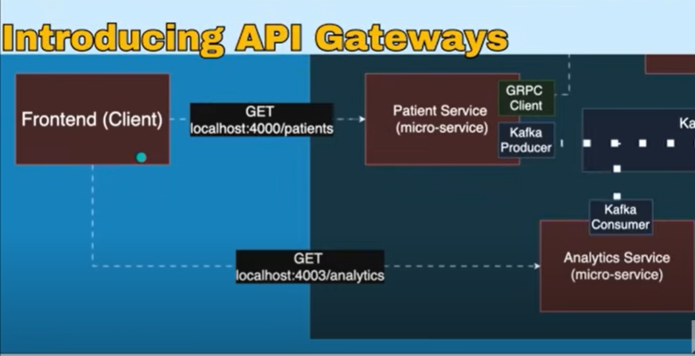

# Patient Management System (WIP)

This project is a work-in-progress **Patient Management System** built using a microservices architecture. It aims to demonstrate various modern development practices including gRPC for inter-service communication, Kafka for event streaming, an API Gateway for routing and authentication, and containerization with Docker. The infrastructure setup is also being explored with AWS services simulated locally using LocalStack.

The project is being developed following a comprehensive YouTube video tutorial.
**Special thanks to [Chris Blakely](https://www.youtube.com/watch?v=tseqdcFfTUY&t=25338s&ab_channel=ChrisBlakely) for the insightful tutorial that guided this project.**

## 🚀 Technologies & Tools

This project utilizes a range of powerful tools and frameworks:

*   **IntelliJ IDEA Ultimate**: Integrated Development Environment (IDE) for Java development.
    *   [Download IntelliJ IDEA Ultimate](https://www.jetbrains.com/idea/download/)
*   **Docker**: Platform for developing, shipping, and running applications in containers.
    *   [Get Started with Docker](https://www.docker.com/get-started)
*   **LocalStack**: A local cloud emulator for developing and testing AWS applications offline.
    *   [LocalStack Cloud](https://localstack.cloud/)
*   **AWS CLI**: Command Line Interface for interacting with AWS services.
    *   [AWS CLI Documentation](https://aws.amazon.com/cli/)
*   **Git Bash (Windows)**: Provides a Bash emulation environment on Windows for Git commands.
    *   [Download Git Bash](https://git-scm.com/downloads)
*   **Spring Boot**: Framework for building production-ready Spring applications.
    *   [Spring Boot Documentation](https://spring.io/projects/spring-boot)

## 🏗️ Project Architecture (Microservices)

The project is structured into several microservices, each with its dedicated functionality. While the specific names of all microservices will be detailed as the project progresses, some key services observed through the development process include:

*   **Patient Service**: Handles patient-related data and operations.
*   **Billing Service**: Manages billing information, likely interacting with the Patient Service via gRPC.
*   **Analytics Service**: Processes events (e.g., patient creation/updates) via Kafka for analytical purposes.
*   **Auth Service**: Manages user authentication and authorization, providing JWT tokens.
*   **API Gateway**: Acts as a single entry point for client requests, handling routing and authentication.

Each microservice typically has a `help.md` file within its directory for specific service-level documentation.

### High-Level Development Architecture

Here's an overview of the microservice interactions within the Docker network during development:

### Spring Boot Service Architecture

Each Spring Boot microservice follows a standard architectural pattern:

### gRPC Communication Flow

The Patient Service communicates with the Billing Service using gRPC:

### Kafka Event Streaming

Kafka is used for asynchronous event streaming between services, specifically for patient-related events:

### API Gateway Integration

Before implementing an API Gateway, a frontend client would typically need to know the specific addresses and ports of each microservice, leading to tightly coupled communication and management overhead:

To centralize access, simplify client interactions, and provide a single entry point, an API Gateway is introduced. It handles request routing, load balancing, and potentially authentication/authorization, abstracting the underlying microservice topology from the client:

This provides a more robust and scalable solution for managing external traffic to the microservices.

### Authentication Flow

The authentication process involves the Auth Service and API Gateway for secure access:

## 📈 Project Progress & Key Milestones

This project is currently under active development. The following outlines the major areas covered so far, mirroring the structure of the guiding YouTube tutorial.

### Core Service Development

*   **Initial Project Setup**: Basic Spring Boot project and module configuration.
*   **Data Layer**: Setting up models, in-memory databases, and repositories.
*   **Service Layer**: Implementing business logic.
*   **REST Endpoints**: Developing and testing API endpoints for CRUD operations (GET, CREATE, UPDATE, DELETE).
*   **Request Validation & Error Handling**: Robust input validation and custom exception handling.
*   **OpenAPI Documentation**: Integrating Swagger/OpenAPI for API documentation.

### Microservices Communication

*   **Dockerization**: Containerizing individual microservices for isolated deployment.
*   **gRPC Integration**: Implementing inter-service communication between Patient Service and Billing Service using gRPC.
*   **Kafka Event Streaming**: Setting up Kafka for asynchronous communication, with the Patient Service as a producer and Analytics Service as a consumer for patient events.

### API Gateway & Security

*   **API Gateway Implementation**: Setting up an API Gateway for routing and centralizing access to microservices.
*   **Authentication Service**: Developing a dedicated authentication service with user management, password encoding, and JWT token generation.
*   **API Gateway Integration with Auth**: Implementing JWT validation and security filters within the API Gateway to secure microservice endpoints.

### Testing

*   **Integration Testing**: Setting up and writing integration tests to verify the end-to-end flow of key functionalities like login and patient retrieval.

### Cloud Infrastructure (LocalStack & AWS)

Here's a depiction of the planned deployment architecture using AWS services (simulated via LocalStack):

*   **LocalStack Setup**: Configuring LocalStack to simulate AWS services locally.
*   **AWS CLI & IAC Introduction**: Familiarization with AWS CLI and Infrastructure as Code (IaC) principles using CloudFormation.
*   **CloudFormation Template Development**: Creating CloudFormation templates for:
    *   Virtual Private Cloud (VPC)
    *   Databases (e.g., RDS)
    *   Amazon Managed Streaming for Apache Kafka (MSK) cluster
    *   Amazon Elastic Container Service (ECS) Cluster and Services
    *   Load-Balanced Application Gateway (ALB)
*   **Local Deployment & Testing**: Preparing Docker images and deploying the entire infrastructure and services to LocalStack.
*   **Stack Management**: Understanding how to delete and troubleshoot local stacks.

## ➡️ Next Steps & Future Work

As the project progresses, additional details regarding specific microservices, deployment strategies, and more advanced features will be documented here. Future updates will include:

*   Detailed descriptions of each microservice.
*   Instructions for running the entire project locally.
*   (Add more specific future plans here as you define them)

---

**Note**: This project is based on a YouTube video tutorial. While aiming to implement the concepts thoroughly, some aspects might be simplified for learning purposes.